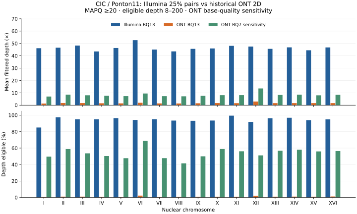

# Yeast WGS comparison

Reproducible **Snakemake** workflow for matched **Illumina paired-end** and **Oxford Nanopore** reads from *Saccharomyces cerevisiae*: read QC, alignment, coverage, small-variant calling and alternate-SNP overlap.

**Status: a matched real yeast dataset has been analyzed.** [Measured P11 results and limitations](docs/results/P11/README.md) include QC, nuclear SNP overlap and an ONT base-quality sensitivity experiment. A separate deterministic synthetic demonstration validates software execution. [Selected-locus read support and IGV review](docs/results/P11/review/README.md) provide a diagnostic follow-up.

## What this project does

| Branch | Steps | Output |
|---|---|---|
| Illumina | FastQC → fastp → BWA-MEM → samtools fixmate/markdup → bcftools | QC, indexed BAM, normalized filtered SNP/indel VCF |
| Nanopore | NanoPlot → minimap2 → samtools → bcftools SNP baseline | QC, indexed BAM, normalized filtered SNP VCF |
| Comparison | Shared depth-eligible regions → exact alternate-SNP intersection | JSON metrics, SNP TSV, shared BED, HTML report |
| Reproducibility | Pinned tool versions, tool/version capture, reference SHA256, logs, benchmarks, CI | Traceable execution |

The ONT caller is an **exploratory bcftools baseline**, not a validated ONT calling solution. Indels and structural variants are not compared. A technology-appropriate caller can be added after chemistry/basecaller metadata are established.

## Real analysis: CIC / Ponton11 (P11)

The [reproducible real run](docs/P11_RUN.md) uses ENA sample SAMEA3895683 with documented diploidy, a 25% paired Illumina subset and 29,914 historical ONT consensus 2D reads. Archive byte counts/MD5 and prepared SHA256 fingerprints are recorded.

Illumina maps at 97.40% and has 45.93× mean filtered nuclear depth. These older ONT reads have mean quality Q8; the primary BQ13 comparison covers only 0.80% of nuclear bases. A controlled ONT BQ7 sensitivity comparison covers 53.31%, with 5,444 shared alternate SNPs and 32,968 Illumina-only alternate SNPs in that domain. The baseline strongly underrepresents heterozygous ONT calls. These measured limitations prevent an accuracy or platform-ranking claim.



```bash
python workflow/scripts/download_reference.py
python workflow/scripts/download_reads.py --manifest config/P11.downloads.json
python workflow/scripts/prepare_real_reads.py --fraction 0.25 --seed 20261001
snakemake -s workflow/Snakefile --configfile config/P11.yaml --cores 4
snakemake -s workflow/quality_sensitivity.smk --configfile config/P11.yaml --cores 2
```

A [six-locus IGV Web review](docs/results/P11/review/IGV_WEB_REVIEW_FR.md) records the observed allele support and unresolved discordances. To repeat or extend the review, follow the [French IGV inspection guide](docs/IGV_REVIEW_FR.md). The dedicated GitHub Actions export reconstructs P11 BAMs and makes a portable regional review ZIP; no local bioinformatics installation is needed to open it in IGV.

See [full QC, both comparison domains and interpretation](docs/results/P11/README.md). Large reads/BAMs/VCFs remain outside Git.

## Run the synthetic demonstration

Use Linux, macOS, or Ubuntu under WSL2 on Windows. Install [micromamba](https://mamba.readthedocs.io/en/latest/installation/micromamba-installation.html) first.

```bash
git clone https://github.com/Gaith2000korchid/yeast-wgs-comparison.git
cd yeast-wgs-comparison
micromamba create -y -f environment.yml
micromamba activate yeast-wgs

python workflow/scripts/generate_demo.py
python -m unittest discover -s tests -v  # pysam is included in the environment
snakemake -s workflow/Snakefile --cores 4 --dry-run
snakemake -s workflow/Snakefile --cores 4 --printshellcmds
python tests/check_demo.py
```

Open `results/report.html` and `results/multiqc/multiqc_report.html`. The demo plants three known SNPs and checks that both branches recover them. It tests workflow execution, not performance on real sequencing data. It has no realistic ONT indel or homopolymer error model.

The environment pins tool versions and compatible NanoPlot plotting dependencies. The real result archive records exact resolved Linux package URLs; other-platform locks are not provided. CI runs the synthetic workflow, the quality-sensitivity integration check and a 12,001-read NanoPlot regression from a clean checkout.

## Use public yeast reads

1. Follow [dataset selection](docs/DATASETS.md). Verify the **same isolate/sample** across technologies, organism, WGS strategy, library layout, chemistry/basecaller, ploidy and file checksums.
2. Copy `config/real.example.yaml` to `config/real.yaml`, replace the reference and sample sheet paths, and fill a copy of `config/samples.real.example.tsv`.
3. Keep the same `sample` identifier on both rows only when the biological match is verified. Supply an uncompressed FASTA reference and `.fastq` / `.fastq.gz` reads. For multiple lanes, concatenate lanes for each mate and retain the lane/run provenance separately.
4. Set ploidy to the documented value (1 or 2). The example's value of 1 is a placeholder, not an assertion about a strain. Aneuploid/polyploid genomes need a separate design.
5. Select `map-ont` for noisy ONT data or `lr:hq` for high-quality ONT data, following minimap2 documentation. Adjust depth thresholds to measured coverage.

```bash
snakemake -s workflow/Snakefile --configfile config/real.yaml --cores 4 --dry-run
snakemake -s workflow/Snakefile --configfile config/real.yaml --cores 4 --printshellcmds
```

## Read the results correctly

- **SNP Jaccard** = shared alternate SNPs / union of alternate SNPs, within the shared depth mask. Empty denominators produce `null`, not 100% agreement.
- **Genotype agreement** is computed only at shared alternate SNPs. It is not genome-wide genotype concordance. Missing and reference-only genotypes are excluded.
- A depth-eligible mask restricts the comparison to positions with sufficient, bounded high-quality coverage in both datasets. It does not prove that all those positions are callable: repeat/mappability and other quality exclusions are still needed.
- An Illumina-only or ONT-only SNP is **discordant**, not automatically true or false. No precision/recall claim is valid without a suitable truth set.
- Normalization/splitting precedes comparison; exact allele matching is used for SNPs. Indel representation equivalence is outside this implementation.

See [methodology and limitations](docs/METHODS.md) and the [French walkthrough](docs/DEMARRER_FR.md).

## Repository layout

| Path | Purpose |
|---|---|
| `workflow/Snakefile` | Both read branches and report dependencies |
| `workflow/scripts/` | Validation, demo generation, streaming coverage, SNP comparison, reporting |
| `config/` | Demonstration configuration and real-data templates |
| `tests/` | Coordinate, comparison, input-validation and integration checks |
| `docs/` | Methods, data provenance and learning sequence |
| `.github/workflows/ci.yml` | Unit tests and synthetic end-to-end execution |

Large reads, BAMs and generated outputs are ignored by Git. Compact measured P11 results and provenance are published under `docs/results/P11/`.

## Learning sources and attribution

This workflow was written for this repository, informed by these resources:

- [Official Snakemake tutorial](https://snakemake.readthedocs.io/en/stable/tutorial/tutorial.html) and [example data](https://github.com/snakemake/snakemake-tutorial-data): workflow dependencies and variant-calling example.
- [Chiara Batini, EMBL-EBI training materials (November 2025)](https://github.com/cbatini/training_materials/blob/main/EBI_NGS_Nov2025/days1_2_mapping_variant_calling_handbook_Nov2025.md): yeast Illumina QC and variant-calling practical.
- [BWA](https://github.com/lh3/bwa), [minimap2](https://github.com/lh3/minimap2), [SAMtools](https://www.htslib.org/doc/samtools.html), [BCFtools](https://www.htslib.org/doc/bcftools.html), [fastp](https://github.com/OpenGene/fastp), [FastQC](https://www.bioinformatics.babraham.ac.uk/projects/fastqc/), [NanoPlot](https://github.com/wdecoster/NanoPlot), [MultiQC](https://docs.seqera.io/multiqc): tool documentation.

MIT license applies to this repository's code. Third-party tools and datasets retain their own licenses. Implementation developed with AI assistance; results require execution and scientific review.
