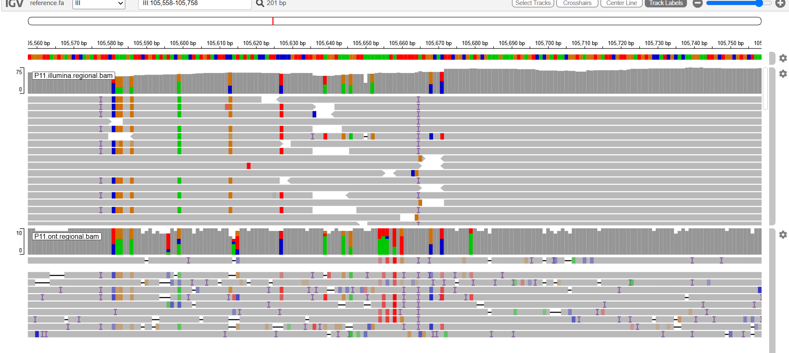
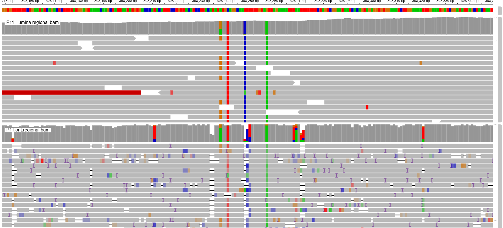

# Revue ciblée P11 dans IGV Web - 1 octobre 2026

Gaith Korchid a consulté six loci du paquet régional P11 dans [IGV Web](https://igv.org/app/) et transmis les valeurs des fenêtres de couverture. Ce compte rendu transcrit ces observations ; il ne constitue pas une validation indépendante des variants. Deux captures partagées dans la conversation montrent les alignements à III:105658 et IV:308249. Les deux captures originales sont maintenant archivées ci-dessous, sans modification. Pour les quatre autres sites, seuls les comptes transmis sont documentés ici.

La référence `reference.fa` et les BAMs `P11.illumina.regional.bam` / `P11.ont.regional.bam` proviennent du [paquet régional](../../../IGV_REVIEW_FR.md), construit par [l'exécution P11](https://github.com/Gaith2000korchid/yeast-wgs-comparison/actions/runs/36871808202). La version exacte d'IGV et les réglages MAPQ, BQ, flags, chevauchement des mates et sous-échantillonnage n'ont pas été relevés. Ces valeurs sont donc des observations de l'affichage, pas une mesure reproductible avec des paramètres entièrement spécifiés.

## Comptes transmis par le reviewer

Les fractions utilisent la somme des bases A/C/G/T/N, indépendamment de `Total Count`. `DEL` et `INS` sont conservés séparément tels que transmis. Un tiret signifie valeur non transmise, pas zéro confirmé.

| Locus | Bases Illumina | Bases ONT | DEL Illumina / ONT | INS Illumina / ONT |
|---|---|---|---|---|
| III:105658 A>T | A=59, T=0 | A=3, T=7 (70 %) | - / - | - / - |
| IV:308249 T>C | T=69, C=0 | A=1, C=12 (92,3 %) | - / 5 | - / - |
| I:2533 G>T | G=8, T=18 (69,2 %) | T=8 (100 % des bases) | - / 1 | - / 1 |
| I:27486 G>A | A=5 (100 %) | G=2, A=14 (87,5 %) | - / - | - / 1 |
| IV:1364942 C>T | C=1, T=28 (96,6 %) | T=8 (100 %) | - / - | 28 / 7 |
| IX:37309 A>G | A=1, G=60 (96,8 %), T=1 | G=13 (100 %) | 6 / 1 | - / - |

[La transcription JSON](igv_web_observations.json) conserve tous les comptes de bases et orientations, les valeurs `Total Count`, `DEL` et `INS`. À I:2533, le popup ONT affiche `Total Count=9`, T=8 et DEL=1, tandis qu'à IV:308249 il affiche `Total Count=13`, A=1, C=12 et DEL=5. Nous conservons ces valeurs sans imposer une formule générale au total affiché. L'insertion peut concerner un alignement portant aussi une base ; ses comptes ne constituent pas des observations de bases supplémentaires. Les libellés HGVS/ClinVar des popups ne sont pas utilisés comme preuve de validation ou de signification clinique.

## Observations descriptives

- **III:105658** : aucune base T dans les comptes Illumina transmis ; T dans 7/10 bases ONT, sur les deux orientations (3+ / 4-). Les pistes de la capture montrent cette différence. Origine de la discordance non résolue.
- **IV:308249** : T dans 69/69 bases Illumina ; C dans 12/13 bases ONT, sur les deux orientations (7+ / 5-), avec cinq délétions signalées au site. La capture de ±100 bases montre de nombreux gaps et marqueurs d'insertion dans les alignements ONT. Cela justifie d'examiner le contexte, sans établir un artefact.
- **I:2533** : mélange G/T en Illumina ; T dans les huit bases ONT observées, sur les deux orientations (3+ / 5-), avec une délétion et une insertion signalées. Compatible avec la différence des génotypes archivés 0/1 et 1/1, sans les valider. Huit bases ONT ne suffisent pas à établir une homozygotie.
- **I:27486** : A soutenu sur les deux orientations en Illumina (3+ / 2-) et ONT (6+ / 8-). Seulement cinq bases Illumina affichées. Le classement ONT-only du VCF filtré ne signifie pas absence d'allèle alternatif dans les lectures Illumina.
- **IV:1364942** : T majoritaire dans les deux plateformes, sur les deux orientations, accompagné de nombreux comptes d'insertion. Leur séquence et leur longueur n'ont pas été examinées dans cette revue. Support partagé malgré le classement ONT-only.
- **IX:37309** : G majoritaire dans les deux plateformes et sur les deux orientations (Illumina 24+ / 36-, ONT 8+ / 5-). Délétions signalées dans les deux pistes. Le T isolé Illumina ne suffit pas à établir un second variant. Support G partagé malgré le classement ONT-only.

## Comparaison avec les mesures externes

| Locus | Alternatif / bases Illumina affichées | Alternatif / fragments Illumina filtrés | Alternatif / bases ONT affichées | Alternatif / lectures ONT filtrées BQ7 |
|---|---:|---:|---:|---:|
| III:105658 | 0/59 | 0/40 | 7/10 | 7/10 |
| IV:308249 | 0/69 | 0/52 | 12/13 | 12/13 |
| I:2533 | 18/26 | 8/14 | 8/8 | 8/8 |
| I:27486 | 5/5 | 3/3 | 14/16 | 14/15 |
| IV:1364942 | 28/29 | 25/26 | 8/8 | 8/8 |
| IX:37309 | 60/62 | 48/49 | 13/13 | 13/13 |

Les mesures [externes archivées](read_support.tsv) utilisent MAPQ≥20, exclusion des flags 3844, BQ≥13 en Illumina et BQ≥7 en ONT, sans BAQ. Les mates Illumina éligibles et concordants sont regroupés par nom de fragment. Les bases supprimées, skips et qualités manquantes sont exclus. Les comptes de l'affichage IGV ne doivent pas remplacer ces mesures ni les DP/AD du caller. Les réglages IGV inconnus empêchent d'attribuer précisément chaque différence à un filtre ou au regroupement des mates.

## Portée et suite

Six des quinze loci sélectionnés ont fait l'objet de cette revue ciblée ; les neuf autres restent non examinés dans IGV. Les loci constituent un échantillon de convenance et ne permettent pas une estimation de précision à l'échelle du génome. Aucun site n'est déclaré vrai positif ou faux positif. La donnée ONT est historique (consensus 2D pass + fail) et ne représente pas les performances des chimies modernes.

Pour approfondir : relever la version et les réglages IGV, archiver les captures avec coordonnées et noms de pistes, inspecter MAPQ/BQ/CIGAR et insertions locales, puis vérifier les intermédiaires d'appel et de filtrage avant d'attribuer une cause aux absences de VCF. Une vérité indépendante serait nécessaire pour mesurer la précision.

Une [reconstruction régionale du caller](REGIONAL_CALLER_AUDIT_FR.md) suit maintenant les trois sites avec support partagé et mesure leur sensibilité à BAQ. Elle complète les observations IGV sans remplacer les intermédiaires du run génome entier.

## Captures originales du reviewer

**III:105658 A>T**, fenêtre `III:105558-105758`. Illumina en haut, ONT en bas. Capture de Gaith Korchid le 1 octobre 2026. Comptes des popups transmis séparément : Illumina A=59/T=0 ; ONT A=3/T=7. Les popups ne figurent pas sur cette capture. La version exacte et les filtres d'affichage ne sont pas connus. Le signal est discordant ; aucune vérité biologique indépendante n'est établie.

**IV:308249 T>C**, fenêtre `IV:308149-308349` saisie par le reviewer ; la capture conserve la règle de coordonnées et les noms de pistes mais coupe la barre de navigation supérieure. Illumina en haut, ONT en bas. Capture de Gaith Korchid le 1 octobre 2026. Comptes transmis séparément : Illumina T=69 ; ONT C=12/A=1 et DEL=5. Les gaps et marqueurs d'insertion visibles motivent l'examen local, sans démontrer un artefact. Les différences entre couverture affichée et mesures filtrées sont documentées plus haut.
