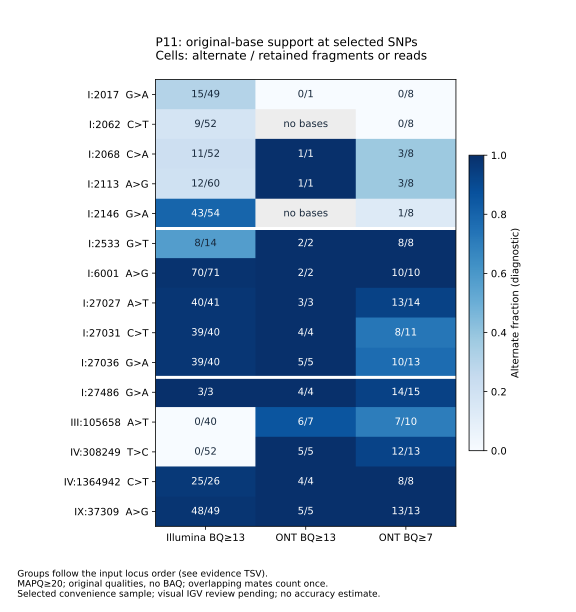

# Selected P11 SNPs: diagnostic read support and IGV review

This follow-up measures original-base support in reconstructed P11 alignments at the **15 loci already selected** in [the BQ7 comparison](../bq7.loci_for_review.tsv). It prepares an IGV session and a review worksheet. A [targeted IGV Web review](IGV_WEB_REVIEW_FR.md) now records six loci examined by Gaith Korchid on 2026-10-01; the remaining nine have not been visually reviewed. These measurements do not establish truth or classify discordances as errors.

## Observed examples



Values are alternate / retained depth: Illumina fragments at BQ13, ONT reads at BQ7. They describe these selected positions only.

| Locus / comparison label | Illumina | ONT BQ7 | Observation |
|---|---:|---:|---|
| I:2068 C>A / Illumina-only | 11/52 | 3/8 | Alternate reads exist in both platforms despite the filtered-call label. |
| I:2533 G>T / shared, discordant GT | 8/14 | 8/8 | Mixed Illumina support, all retained ONT bases alternate; archived GT is 0/1 vs 1/1. |
| I:27486 G>A / ONT-only | 3/3 | 14/15 | Illumina alternate support exists, but diagnostic fragment depth is low. |
| III:105658 A>T / ONT-only | 0/40 | 7/10 | Different allele support in the two alignments; prioritize visual inspection. |
| IV:308249 T>C / ONT-only | 0/52 | 12/13 | Different allele support in the two alignments; prioritize visual inspection. |
| IV:1364942 C>T / ONT-only | 25/26 | 8/8 | Strong alternate support in both alignments. |
| IX:37309 A>G / ONT-only | 48/49 | 13/13 | Strong alternate support in both alignments. |

Three of the five selected ONT-only loci have alternate observations in Illumina. No retained Illumina alternate base is observed at the other two. This is a diagnostic distinction, not a precision estimate. A [regional caller audit](REGIONAL_CALLER_AUDIT_FR.md) reconstructs calling and filtering at the three sites with Illumina alternate support: all three are removed by FORMAT/DP, one also by QUAL. Disabling only BAQ rescues two in this regional experiment. Original full-genome caller intermediates have not been reconstructed, so these are not historical full-run DP/QUAL values. Do not assign a causal filter explanation or truth label from these counts alone.

The ONT BQ13 view retains 0–7 bases at these loci, versus 8–15 at BQ7. Fractions based on one or two bases should not be read as confident genotype evidence. All alternate ONT observations here lie on alignments containing some soft clipping; that annotation records clipping **anywhere in the alignment**, not necessarily at the locus. It does not itself demonstrate a local mapping artifact.

## Selection and measurement

There are five `illumina_only`, five `shared` and five `ont_only` records. Selection takes the first five records per category in the archived comparison order. The Illumina-only examples cluster at the start of chromosome I; this convenience sample is not representative of chromosome-wide or genome-wide behavior. One shared site also has discordant genotypes. A blank genotype means no matching alternate-SNP entry in that filtered comparison; it does not establish a reference genotype or absence of alternate reads.

The diagnostic script uses indexed BAM fetch and aligned query/reference pairs, MAPQ≥20, and excludes SAM flags 3844 (unmapped, secondary, QC failure, duplicate and supplementary). It reads **original** base qualities without BAQ, using Illumina BQ≥13 and ONT BQ≥13 / ≥7. Deletions, reference skips and missing sequence/quality do not contribute bases. Other bases contribute to depth and the denominator, and are reported separately.

For Illumina, eligible observations sharing a query name count once when their bases agree; conflicting eligible mates are excluded. Base-quality filtering occurs before this decision. The highest-quality agreeing observation supplies the strand/end-position annotation, with read1 breaking ties. ONT records count individually. These rules are diagnostic and differ from bcftools overlap/BAQ/orphan handling and samtools depth; values are **not caller DP, AD, GQ or recomputed genotypes**. A fraction at zero retained depth is missing (`null`), never zero support.

[TSV evidence](read_support.tsv) contains all three views of each locus. [JSON evidence](read_support.json) adds filter counts, base counts, versions and source SHA256 fingerprints. End/strand/clipping annotations identify aspects to examine, without significance tests or error labels.

## Reproduce the measurements

First restore the reference and reads and run the [documented P11 workflow](../../../P11_RUN.md). The session requires regenerated local BAMs and indexes; GitHub does not host these large files.

```bash
# From the repository root, after reconstructing P11 BAMs:
micromamba create -y -f environment-review.yml
micromamba run -n yeast-wgs-review python workflow/scripts/review_loci.py
micromamba run -n yeast-wgs-review python workflow/scripts/plot_review.py
```

This writes `results/P11/review/`. Keep its XML beside the outputs: paths are relative to the session file. The archived [IGV session](igv_session.xml) instead resolves relative to `docs/results/P11/review/`, pointing to the same repository-root `data/real/reference.fa` and `results/P11/bam/` paths. Use the local S288C FASTA, not a differently named online genome build.

For an easier Windows setup, use the [portable regional bundle and French inspection guide](../../../IGV_REVIEW_FR.md). The complete-reference/regional-BAM package includes its own indexes and tests evidence preservation at these 15 loci.

## Perform the visual review

1. Install IGV Desktop and open the local `igv_session.xml` using **File → Open Session**. The reference, two BAMs and BAM indexes must exist at the indicated paths. XML structure and path resolution are tested; GUI loading has not been tested in this environment.
2. Navigate to each coordinate in [regions.bed](regions.bed) / the evidence TSV; displayed locus coordinates are 1-based, BED intervals are 0-based half-open. Zoom to approximately ±100 bases, then widen to inspect mapping context.
3. Examine both strands, read ends, soft clipping, neighboring indels, mapping quality, overlapping mates and local repetition. Record the IGV version and display filters, particularly mapping/base-quality thresholds and downsampling. The diagnostic counts are computed outside IGV and need not equal the displayed coverage.
4. Copy [visual_review_template.tsv](visual_review_template.tsv) into a working review file. Record reviewer/date, observations and screenshot paths. Use descriptive observations such as “alternate observed on both strands”; distinguish them from validated biological conclusions.

[Official IGV session documentation](https://igv.org/doc/desktop/UserGuide/sessions/) · [pysam 0.23.3 API](https://pysam.readthedocs.io/en/v0.23.3/api.html).
